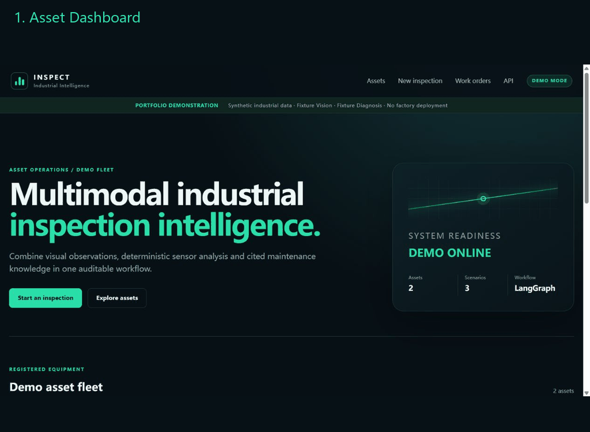
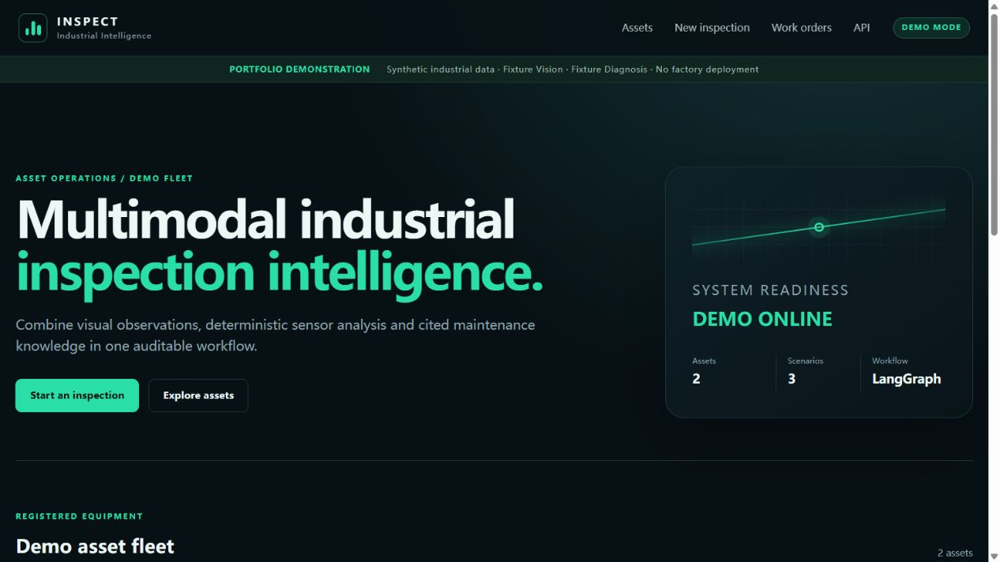
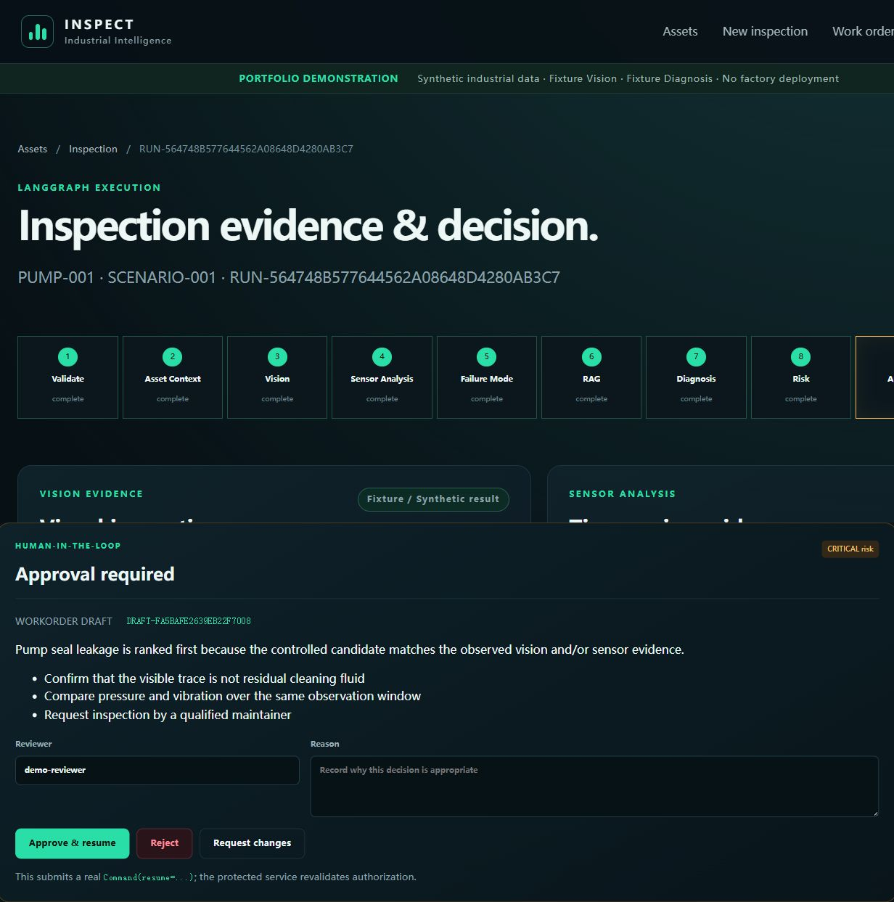
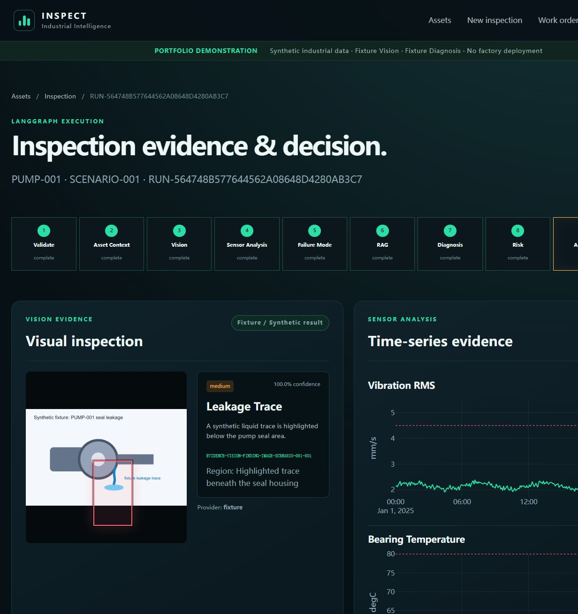
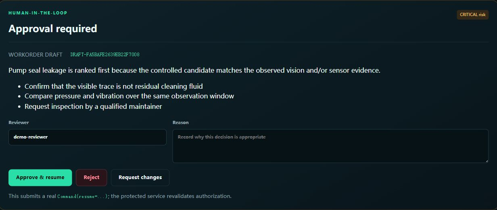
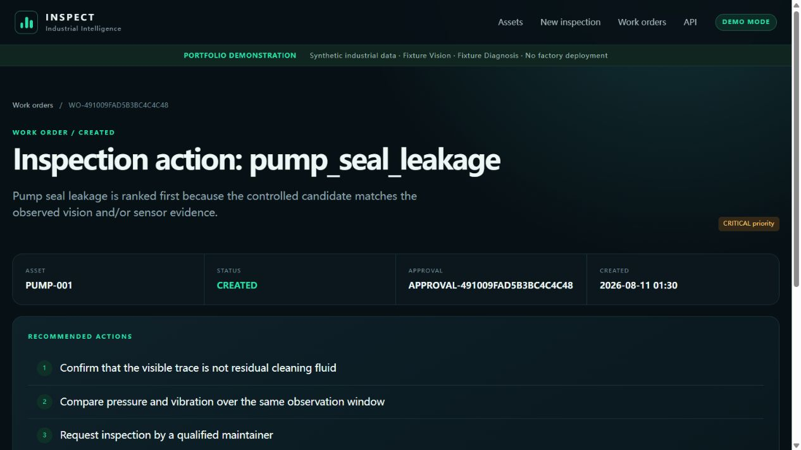
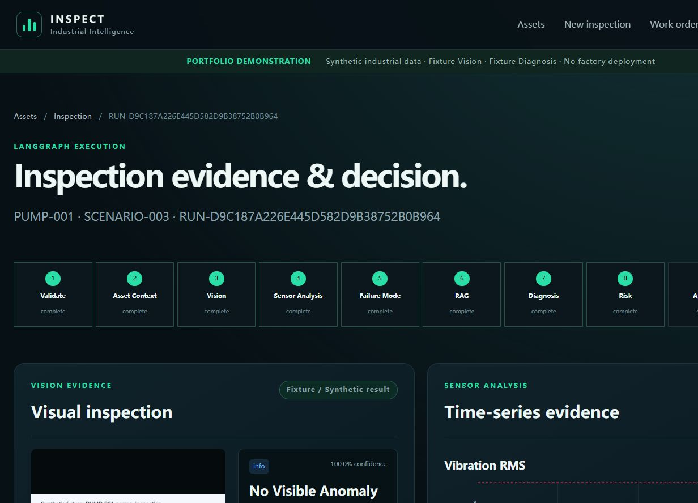
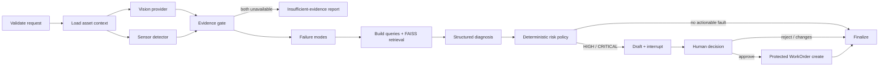
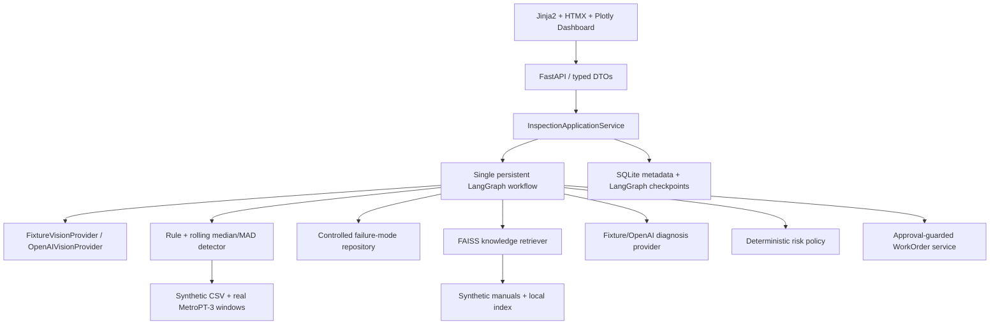

# Multimodal Industrial Inspection & Fault Diagnosis Agent


An evidence-driven portfolio application that combines inspection images, historical sensor analysis, maintenance knowledge, persistent workflow state, human approval, and protected WorkOrder creation.

> The end-to-end multimodal scenarios remain synthetic. The repository additionally includes two attributed sensor windows derived from the real MetroPT-3 railway APU dataset. This project is not factory-validated or a production safety system.



## Overview

The application demonstrates one complete inspection loop for two synthetic assets (`PUMP-001`, `MOTOR-001`) and three versioned scenarios. A separate `APU-001` profile evaluates real operational compressor sensor data from MetroPT-3 without pretending that the source includes images or factory validation. A single LangGraph workflow coordinates typed services; deterministic Python handles sensor anomalies and risk; an LLM provider is limited to evidence-aware synthesis.

## Why this project

Industrial inspection evidence is split across visible conditions, sensor histories, failure-mode knowledge, and maintenance procedures. A useful workflow must keep those sources separate, preserve their provenance, and turn a diagnosis into an auditable action without letting a language model guess measurements or bypass approval.

## Why Agent instead of a RAG Chatbot

RAG is only one evidence source. The implemented system also validates image artifacts, executes a deterministic time-series detector, routes degraded branches, maintains graph state, retrieves controlled failure modes, applies a deterministic risk policy, interrupts for approval, persists checkpoints, and protects WorkOrder side effects. These state transitions and conditional actions are the reason for LangGraph; the project does not split deterministic modules into decorative “agents.”

## Demo

The quick-start page provides three fixed paths:

| Scenario | Synthetic outcome | Workflow behavior |
| --- | --- | --- |
| `SCENARIO-001` | Pump seal leakage evidence | `CRITICAL` → approval → WorkOrder on approve |
| `SCENARIO-002` | Motor bearing fault evidence | `HIGH` → approval → no WorkOrder on reject |
| `SCENARIO-003` | Normal pump inspection | `LOW` → no fault, Draft, approval, or WorkOrder |

Fixture Vision and Fixture Diagnosis are visibly labeled in the UI. They provide reproducible workflow tests and do not claim pixel inference.

## Screenshots

| Asset Dashboard | Pump CRITICAL path |
| --- | --- |
|  |  |

| Multimodal evidence | Human approval |
| --- | --- |
|  |  |

| WorkOrder created | Normal scenario |
| --- | --- |
|  |  |

## Workflow



## Architecture



## Key Features

- One checkpointed LangGraph workflow with degraded routing and real `interrupt` / `Command(resume=...)` behavior.
- Secure PNG/JPEG/WebP upload validation, generated filenames, hashes, decode checks, and path confinement.
- Deterministic historical-window sensor analysis with data-quality reporting and anomaly segments.
- Reproducible MetroPT-3 download, two-level SHA-256 verification, derived real sensor windows, and event-window evaluation.
- Controlled failure-mode candidates and citation-bearing FAISS retrieval.
- Structured diagnosis with primary/alternative candidates, supporting/contradicting evidence, missing evidence, and uncertainty.
- Deterministic risk matrix and approval-protected, idempotent WorkOrder creation.
- FastAPI API plus a server-rendered Dashboard requiring no Node build pipeline.
- Offline evaluation, Ruff, Mypy, pytest, package build, repository-hygiene scan, and GitHub Actions workflow.

## Evidence-driven Diagnosis

Vision findings, sensor segments, and knowledge chunks become a shared `EvidenceRef` containing an evidence ID, kind, source ID, summary, and observation timestamp. Diagnosis output may cite only IDs included in its input bundle; unknown evidence or failure-mode candidates are rejected at the provider boundary. The Dashboard links diagnosis references back to visible evidence cards.

## Sensor Analysis

The detector combines configured operating limits with a centered rolling median/MAD robust score, data-quality validation, and contiguous segment aggregation. It analyzes a bounded offline historical CSV window; it is not a real-time streaming detector. Numerical anomaly decisions are Python code, not LLM estimates.

The [MetroPT-3 profile](docs/METROPT3_DATA.md) adds real operational pressure, oil-temperature, and motor-current measurements from a metro-train compressor APU. It is evaluated separately because it has company failure-event windows but no point-level sensor labels or synchronized images. The unchanged detector alerts 36.39% of timestamps in the outside-report reference window and 0.83% in the reported Air-leak window; this negative result is evidence that the synthetic-demo detector is not calibrated for the real operating-state transitions, not an accuracy claim.

## Vision

`FixtureVisionProvider` is the default deterministic adapter. It validates versioned fixture hashes and returns explicitly synthetic findings without inspecting pixels.

`OpenAIVisionProvider` reads the actual PNG/JPEG/WebP artifact, sends image bytes plus non-evaluative asset context and a finite visual-label vocabulary, and parses the response into the same `VisionAnalysisResult`. Its prompt prohibits final fault diagnosis, and the provider never receives scenario ground truth, expected failure modes, or evaluation labels.

**Real Vision provider implemented but not live verified:** no usable API key was available in the final local validation environment. The opt-in three-image smoke test requires `RUN_LIVE_TESTS=1`; default pytest and CI never make paid calls.

## RAG

The small synthetic knowledge base contains original demo manuals and an inspection SOP. Documents are chunked with metadata, embedded by a deterministic local demo embedder, stored in FAISS, filtered by asset type, and returned with title, section, excerpt, score, and chunk ID. It is evidence retrieval, not a general industrial knowledge base.

## Human-in-the-loop

HIGH/CRITICAL drafts trigger a LangGraph interrupt. The persisted approval binds the immutable Draft ID and content hash. Resume records approve/reject/request-changes, while the WorkOrder service revalidates risk, decision, hash, and Draft state at the side-effect boundary.

## Persistence and Idempotency

- SQLite stores demo metadata, inspections, runs, drafts, approvals, WorkOrders, and independent ToolTrace attempts.
- `langgraph-checkpoint-sqlite` persists graph state across process restart.
- A unique Draft-to-WorkOrder relationship and stable idempotency key prevent duplicate WorkOrders.
- CSV files keep time-series data outside graph checkpoints; FAISS and chunk metadata can be rebuilt from tracked source files. The full MetroPT-3 archive stays in ignored runtime storage.

## Evaluation

Run `inspection-agent evaluate` to create [evaluation/report.json](evaluation/report.json) and [evaluation/report.md](evaluation/report.md). Ground truth is opened only by the scorer after workflow execution.

| Area | Measured offline result | Scope |
| --- | ---: | --- |
| Sensor point precision / recall / F1 | 1.0000 / 0.8917 / 0.9427 | 2 anomalous synthetic scenarios; normal reported separately |
| Sensor segment precision / recall / F1 | 1.0000 / 1.0000 / 1.0000 | 4 injected segments |
| Normal case | Pass | 1 scenario; no undefined positive-class F1 claim |
| MetroPT-3 reference alert rate | 36.39% | 1 real six-hour window outside published failure reports; not verified healthy |
| MetroPT-3 Air-leak-window alert rate | 0.83% | 1 real six-hour window inside a company failure report; no point labels |
| Retrieval Recall@1 / Recall@3 / MRR | 1.0000 / 1.0000 / 1.0000 | Only 4 manually defined queries |
| Workflow task success | 3/3 | Synthetic scenario task success, not diagnosis accuracy |
| Safety/idempotency checks | 5/5 | Approval, bypass, duplicate create, restart/resume, dual failure |

Synthetic metrics remain deterministic portfolio-fixture results. MetroPT-3 numbers are event-window observations, not precision/recall/F1, industrial diagnosis accuracy, real Vision accuracy, or a production benchmark.

## Testing

Default tests are offline and use Fixture Vision/Diagnosis. Current local validation collected **105 tests: 104 passed and 1 opt-in live Vision test skipped**. Coverage includes schemas, seed reproducibility, synthetic and real sensor profiles, provenance/tamper checks, retrieval, provider boundaries, workflow routing, degraded modes, approval enforcement, idempotency, restart/resume, API/upload security, templates, and three scenario flows. The same counts are recorded in `evaluation/report.json`.

```bash
ruff check .
mypy src
python -m pytest
inspection-agent check-hygiene
inspection-agent evaluate
python -m build
```

## Quick Start

Requires Python 3.12+.

```bash
git clone https://github.com/zhanglonglong01/multimodal-industrial-inspection-agent.git
cd multimodal-industrial-inspection-agent
python -m pip install -e ".[dev]"
inspection-agent init-web-demo
uvicorn inspection_agent.web:app --host 127.0.0.1 --port 8000
```

Open <http://127.0.0.1:8000>. API documentation is at <http://127.0.0.1:8000/docs>.

## Real Sensor Data

The two small attributed MetroPT-3 windows required for offline validation are already versioned. To reproduce them from the official 208 MB UCI archive:

```bash
inspection-agent download-metropt3
inspection-agent prepare-metropt3
inspection-agent validate-metropt3
inspection-agent evaluate-metropt3
```

The source is real railway APU operational data licensed CC BY 4.0, not factory production-line data. Raw files remain under ignored `data/runtime/metropt3/`; source and derived hashes, preprocessing, timestamp assumptions, failure reports, and limitations are documented in [docs/METROPT3_DATA.md](docs/METROPT3_DATA.md).

## Docker

```bash
docker compose up --build
```

The single container seeds SQLite, rebuilds the FAISS index, creates writable runtime directories, and exposes `/health` and `/ready`. Runtime DB, checkpoints, index, and uploads use a named volume. Docker could not be run on the local Windows validation host; the GitHub Actions workflow contains Linux image build and container `/health`/`/ready` smoke checks. Do not describe Docker as CI-verified until that workflow has actually completed successfully on GitHub.

## Live Mode

Copy `.env.example` to `.env` and keep secrets untracked.

Real Vision with deterministic diagnosis:

```dotenv
APP_MODE=demo
VISION_PROVIDER=openai
INSPECTION_OPENAI_API_KEY=<your-key>
INSPECTION_OPENAI_VISION_MODEL=gpt-5-mini
```

Enable the already implemented OpenAI diagnosis adapter as well:

```dotenv
APP_MODE=live
INSPECTION_OPENAI_DIAGNOSIS_MODEL=gpt-5-mini
```

Paid three-image smoke test:

```bash
RUN_LIVE_TESTS=1 inspection-agent evaluate-vision-live
```

Never commit `.env`, keys, smoke responses containing sensitive data, or runtime artifacts.

## Project Structure

```text
src/inspection_agent/
├── application.py          # Web-independent use cases
├── workflow.py             # LangGraph nodes, routing, checkpoint runtime
├── services/               # Vision, sensor, RAG, diagnosis, risk, WorkOrder
├── web.py                  # FastAPI routes and HTML controllers
├── templates/ + static/    # Jinja2/HTMX/Plotly Dashboard
├── portfolio_evaluation.py # Unified offline report
├── metropt3.py             # Real sensor download, preparation, validation, evaluation
└── hygiene.py              # Tracked-file secret/runtime checks
data/demo + knowledge/      # Versioned synthetic scenarios and documents
data/real/metropt3/         # Attributed derived real operational sensor windows
evaluation/                 # Generated committed Portfolio report
docs/images/                # Actual demo screenshots and GIF
tests/                      # Offline unit and integration suite
```

## API

Main routes: `GET /health`, `GET /ready`, `GET /api/assets`, `GET /api/assets/{id}`, `POST /api/inspections`, `POST /api/inspections/{id}/run`, `GET /api/runs/{id}`, `POST /api/approvals/{id}/decision`, and WorkOrder list/detail endpoints. Errors use `code`, `message`, `details`, and `request_id`.

## Design Decisions

- **One workflow, not multiple agents:** Vision, sensor, RAG, risk, and WorkOrder remain typed services; only evidence/query synthesis needs model reasoning.
- **SQLite/FAISS instead of PostgreSQL/Qdrant:** the fixed portfolio scope benefits from zero external services and reproducible local startup.
- **Deterministic sensor and risk logic:** measurements, thresholds, permissions, and side effects must be testable and auditable.
- **Fixture providers by default:** tests, CI, interviews, and demos must work without credentials, network access, cost, or nondeterministic provider output.
- **Provider abstraction:** real Vision/Diagnosis adapters can replace fixtures without changing workflow schemas or evaluation ground truth.
- **Separate real-data profile:** MetroPT-3 is not inserted into the synthetic multimodal Workflow because it has no synchronized images, manuals, or point-level anomaly labels.

## Relationship to IBM AssetOpsBench

The project was inspired by and researched [IBM AssetOpsBench](https://github.com/IBM/AssetOpsBench), particularly its industrial asset-operations scenarios and its treatment of IoT/time-series evidence, failure modes, work orders, tools, and evaluation.

This repository is not a fork, does not copy AssetOpsBench source code or benchmark scores, and is not endorsed by IBM. AssetOpsBench focuses on an industrial-agent benchmark/evaluation framework; this project focuses on a small end-user multimodal inspection application with a Dashboard, image evidence, RAG, persistent HITL, and a protected action loop. See [the detailed analysis](docs/ASSETOPSBENCH_ANALYSIS.md).

## Limitations

- The complete multimodal Workflow still has only two synthetic assets, three synthetic scenarios, four manual retrieval queries, and three schematic images.
- MetroPT-3 contributes only two six-hour real sensor windows; it is railway APU data, not factory production-line or synchronized multimodal data.
- MetroPT-3 event reports are coarse windows. The outside-report reference is not verified healthy, and current detector alerts show poor calibration for compressor state transitions.
- Fixture providers are the reproducible default; real Vision was not live-verified in the final local environment.
- No real factory, PLC, SCADA, CMMS, streaming bus, production authentication, RBAC, or industrial safety validation.
- Historical-window CSV analysis, not online condition monitoring.
- SQLite and synchronous execution target a single-container demo, not concurrent distributed production.
- Public-CDN HTMX/Plotly assets require internet access for charts in the current browser UI.
- Synthetic evaluation demonstrates expected task behavior only; it cannot support accuracy, ROI, reliability, or generalization claims.

## Roadmap

Potential future work—not implemented in v1.0—includes factory-approved multimodal datasets, a MetroPT-3-specific calibrated detector with leakage-safe temporal splits, calibrated real-Vision evaluation, authenticated reviewers, external artifact storage, asynchronous jobs, richer observability, and an optional MCP gateway. These are roadmap items, not current features.

## License

Project code is released under the [MIT License](LICENSE). The derived MetroPT-3 windows retain the dataset's CC BY 4.0 terms and attribution in [data/real/metropt3/LICENSE_NOTICE.md](data/real/metropt3/LICENSE_NOTICE.md). Third-party projects retain their own licenses and trademarks.
