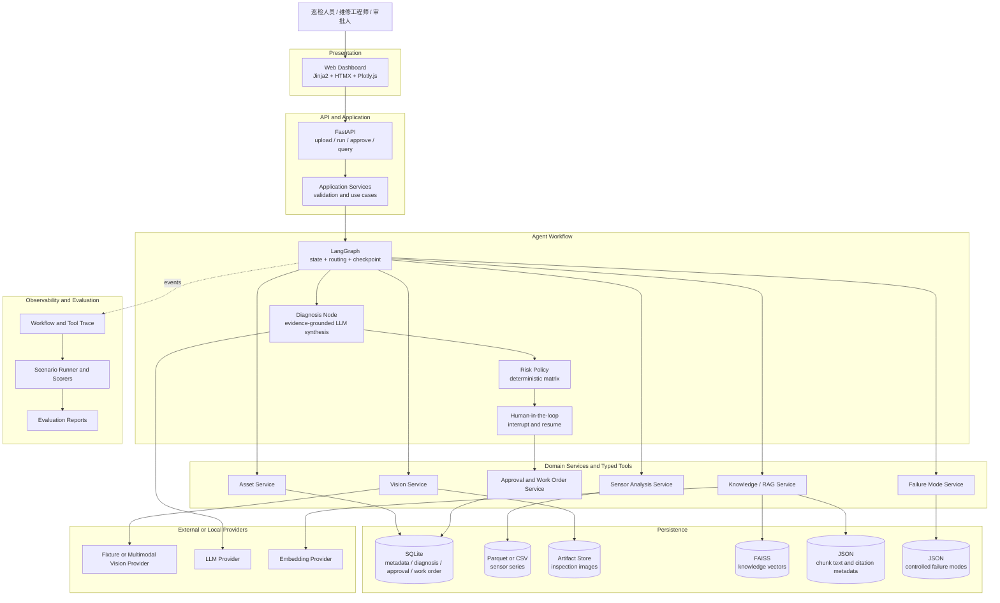
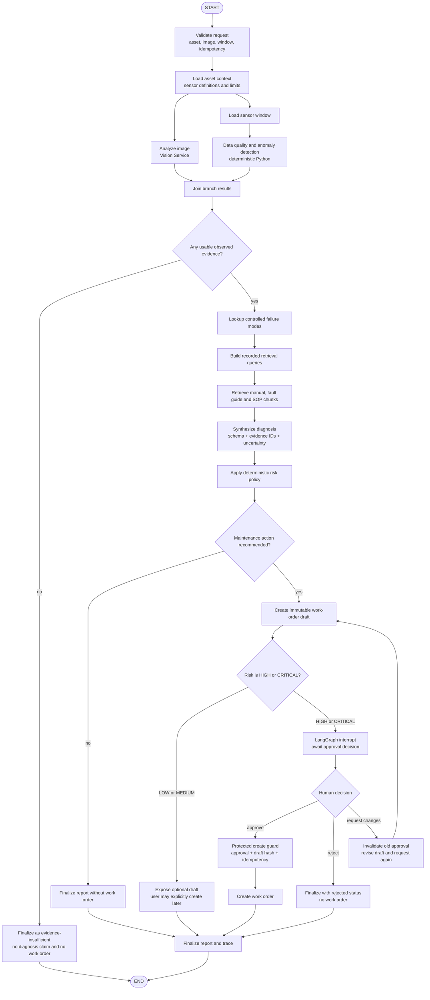
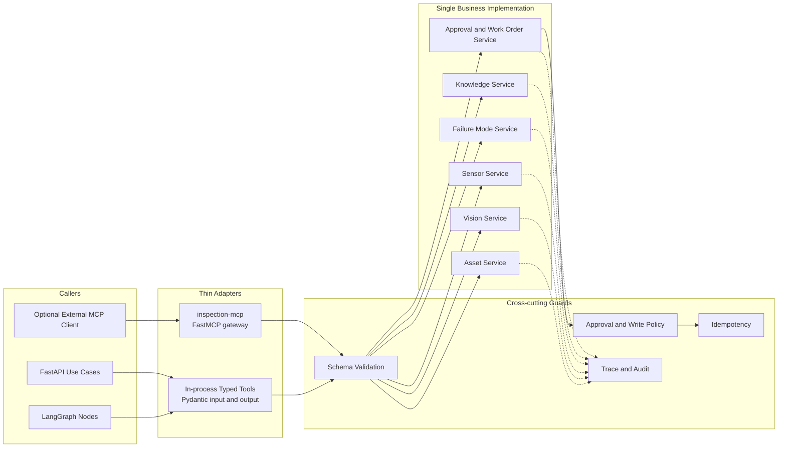
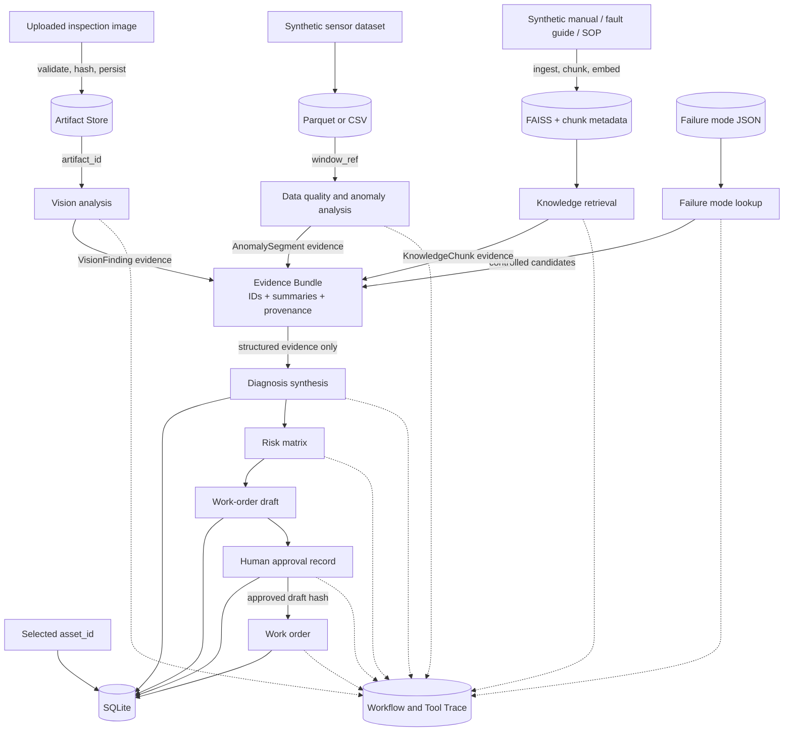
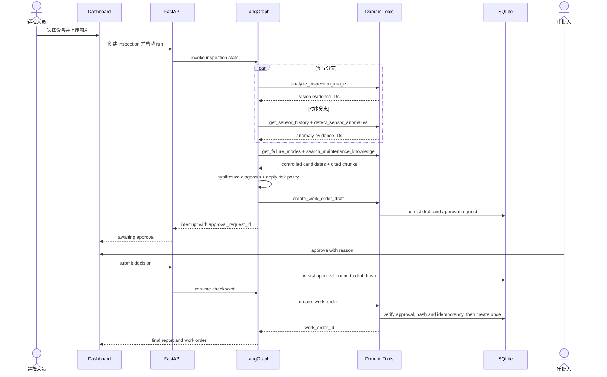

# 系统架构设计

> 当前状态：Phase 2 已实现 SQLite/CSV demo 数据、Fixture Vision、确定性时序分析、JSON Failure Mode、FAISS 本地检索和模块级 evaluation。  
> 本文中的 LangGraph、Diagnosis、Risk、FastAPI、Dashboard、审批和工单仍是后续开发边界，不代表仓库当前已有对应实现。

## 1. 架构目标

- 支持“图片 + 时序 + 故障模式 + 维修知识 + 人工审批 + 工单”的端到端闭环。
- 确定性算法、LLM 推理和数据库副作用边界清楚。
- 无 API Key 时仍可用 synthetic data 与 fixture provider 演示。
- LangGraph 工作流可观测、可暂停、可恢复、可幂等重放。
- 核心领域服务不依赖 LangGraph、FastAPI 或 MCP，方便单测和替换适配器。
- MVP 使用 SQLite/FAISS/本地文件，避免为个人项目引入不必要的分布式基础设施。

## 2. Overall System Architecture



### 2.1 分层说明

- Dashboard 不直接访问 storage 或 provider。
- FastAPI 负责传输层与用例入口，不承载诊断算法。
- LangGraph 只保存 ID 和结构化小结果；图片、时序和大文档通过引用访问。
- Domain Service 是唯一业务事实来源，Tool、API 和 MCP 都是适配器。
- 诊断 LLM 只接收已筛选的 Evidence，不直接执行 SQL、读取任意路径或写工单。
- Risk Policy 与 WorkOrder Guard 是确定性代码，即使 Agent 路由错误也不能绕过。

## 3. Agent Workflow



### 3.1 Workflow 约束

- Vision 与 sensor analysis 可以并行，二者互不伪造对方结果。
- 允许单分支降级，但报告必须保留 warning 并降低 evidence strength。
- 两个观察分支都不可用时，不进入故障定性和工单路径。
- `synthesize_diagnosis` 只能引用 state 中已存在的 evidence IDs。
- risk level 由 policy 计算，LLM 不能在输出中覆盖。
- HIGH/CRITICAL 的 graph resume 只是第一层检查；write service 还会二次验证。
- 同一个 `draft_id + idempotency_key` 重放只返回已有工单。

## 4. Tool Architecture / Post-core Optional MCP

Phase 1-3 只使用进程内 typed service/tool 调用，不实现 MCP。下图中的 FastMCP gateway 是核心闭环完成后才重新评估的可选外部适配器，不属于 MVP 核心开发路径。



### 4.1 为什么 Phase 1-3 不实现 MCP Server

MVP 是单机应用，MCP server 会增加进程发现、连接、环境变量和启动延迟，却不会增加领域隔离的实质价值。Phase 1-3 的领域隔离由 Python module、interface、schema 和测试完成。核心闭环完成后，只有在确有外部客户端接入或协议展示价值时，才考虑一个复用既有业务服务的可选 gateway。

### 4.2 Tool contract

每个 Tool 返回稳定 envelope：

```text
ToolResult<T>
├─ schema_version
├─ trace_id
├─ status: success | partial | error
├─ data: T | null
├─ warnings[]
└─ error: code, message, retryable | null
```

Tool 不返回 secret、图片二进制或无限长时序。大型结果返回 `artifact_id`、`window_ref` 或 `result_id`。写 Tool 必须声明副作用、支持 idempotency，并由 service 而不是 prompt 执行权限判断。

## 5. Data Flow



### 5.1 数据分类

| 数据 | 是否进入 LLM | 保存位置 | 说明 |
| --- | --- | --- | --- |
| 原始图片 | 仅发送给配置的 Vision provider | artifact store | 不写普通日志 |
| 完整时序 | 否 | Parquet/CSV | Python 算法处理 |
| 时序摘要/异常区间 | 是 | SQLite + state | 数值已由算法计算 |
| 完整知识文档 | 否 | source files | 只将 top-k chunks 送入 LLM |
| RAG chunk | 是 | metadata + FAISS | 带 chunk/source/section ID |
| failure mode 候选 | 是 | SQLite/YAML seed | 受控、带来源 |
| diagnosis | LLM 生成后校验 | SQLite | 必须引用 evidence IDs |
| risk level | 否，由 policy 生成 | SQLite | 保存 policy version |
| approval | 人工输入 | SQLite | 绑定 draft hash |
| work order | 否，由 service 写入 | SQLite | 受保护且幂等 |

## 6. 关键时序

### 6.1 高风险批准



## 7. 安全与可靠性边界

- 上传路径由服务端生成；拒绝路径穿越、非法 MIME 和超限文件。
- 所有 API Key 只从环境变量读取；`.env` 不提交，日志过滤 secret。
- fixture 与真实 provider 结果在 schema 和 UI 中明确区分。
- 不把自由文本模型输出直接当成正式实体，必须通过 Pydantic 和领域校验。
- Diagnosis 不得产生不存在的 evidence 引用。
- WorkOrder 写入必须验证 approval、draft hash、risk policy 和 idempotency。
- checkpoint 不保存二进制和超大 payload。
- evaluation 读取固定版本 fixture，不能依赖会变化的在线结果作为唯一 ground truth。

## 8. 部署拓扑

MVP 默认单容器/单进程应用，挂载一个数据卷：

```text
Browser -> FastAPI application
             ├─ LangGraph
             ├─ SQLite
             ├─ FAISS index
             ├─ image artifacts
             └─ Parquet/CSV sensor data
```

真实 Vision/LLM/Embedding provider 是可选外部依赖。未来迁移到 PostgreSQL、Qdrant 或 worker queue 时，domain interface 和 Tool schema 保持不变。

## 9. 架构决策记录摘要

| 决策 | 选择 | 被放弃的 MVP 方案 | 原因 |
| --- | --- | --- | --- |
| Agent 编排 | 单一 LangGraph | 同时维护多个 Runner | 项目目标不是框架 benchmark |
| Tool 调用 | Phase 1-3 仅 in-process | MCP 或每域独立进程 | 更易启动和排错；可选 gateway 留到核心闭环后决策 |
| 数据库 | SQLite | CouchDB/PostgreSQL | 单用户 demo 足够，事务和约束清楚 |
| 时序存储 | Parquet/CSV 引用 | 将所有观测写 SQLite | 更适合列式分析和 fixture 版本化 |
| 向量库 | FAISS | Qdrant | 小型本地语料无需服务化 |
| 时序算法 | limit + rolling MAD | 直接上 TSFM | 可解释、可测试、有基线 |
| 风险 | 确定性矩阵 | LLM 直接输出最终等级 | 可审计、可复现 |
| 前端 | Jinja2/HTMX/Plotly.js | React SPA | 降低个人项目非核心工作量 |
| 离线演示 | fixture provider | 必须有 API Key | 招聘演示和 CI 可复现 |

## 10. 与 AssetOpsBench 的架构关系

保留的思想是领域工具边界、typed schema、数值任务确定性执行、大结果引用、轨迹持久化和离线 evaluation。修改之处是从“多个领域 server + 多编排器 + benchmark data reset”收敛为“一个最终用户应用 + 一个 LangGraph + 共享领域服务”。视觉巡检、维修 RAG、审批对象、write guard 和 Dashboard 是本项目为业务闭环新增的核心架构。
